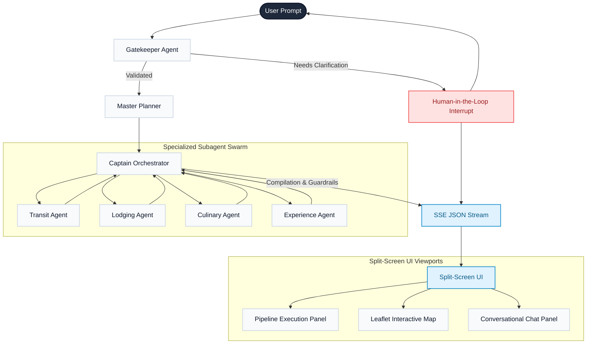

# OdysseyAI Travel Swarm

OdysseyAI is a real-time, stateful, multi-agent travel planning system. It features a **Python FastAPI + LangGraph** backend orchestration swarm and a split-screen **Next.js (App Router) + TypeScript** frontend with interactive maps and dynamic execution pipelines.

---

## 🏗️ System Architecture

OdysseyAI operates as a stateful, directed acyclic graph built on **LangGraph**. A shared `AgentState` schema tracks parameters and gathers candidate recommendations from a swarm of specialized subagents before compiling a final, guardrail-checked itinerary.



---

## 🌟 Key Features

1. **Master Planner (ReAct Loop)**: Breaks down regional travel requests (e.g., "North India" or "Kerala") into specific destinations and daily allocations, using search snippets to calculate optimal routes.
2. **Stateful Subagent Swarm**: Specialized agents query flights, hotels, dining spots, and sightseeing attractions sequentially to build candidate registries.
3. **Interactive Split-Screen UI**:
   - **Pipeline Console**: Visualizes live execution phases, active tool calls, and discovered candidate counts.
   - **Leaflet Map**: Renders route pathing segments with color-coded custom markers.
   - **Conversational Console**: Includes suggesting prompt chips, custom interrupt forms, and final compilation validation warnings.
4. **Human-in-the-Loop Interrupts**: Prompts users directly in the chat interface if core parameters (e.g. destinations, dates) are missing, pausing graph execution state.
5. **Secure IP-based Rate Limiter**:
   - Limits users to **2 successful itineraries per 24 hours** per IP.
   - Resuming in-progress threads is permitted and does not consume extra quota.
   - **Concurrency Safe**: Reserves slot capacity in an `in_progress` state upon admission to prevent double-spending the rate limit.
   - **Failsafe Release**: Releases reservations (marks status as `failed`) if a run crashes, fails, or the client disconnects before completion.
   - **Proxy Guard**: Defaults strictly to client TCP socket hosts, only honoring `X-Forwarded-For` headers if `TRUSTED_PROXY=true` is enabled.
   - **Accessibility Compliant**: Renders warnings inside a screen-reader friendly modal dialog (`role="dialog"`, `aria-modal`, keyboard focus traps).

---

## 📁 Repository Structure

```
travel-agents/
├── backend/
│   ├── src/
│   │   ├── agents/          # LLM Node definitions (gatekeeper, planner, captain)
│   │   │   └── subagents/   # Subagent modules (stay, travel, food, sightseeing)
│   │   ├── graph/           # State schemas and types
│   │   ├── tools/           # Custom search, routing, and flights API integrations
│   │   └── utils/           # Logger and IP RateLimiter components
│   └── server.py            # FastAPI streaming server endpoints
├── frontend/
│   ├── src/
│   │   ├── app/             # App Router layout, page, and globals styles
│   │   ├── components/      # UI components (Map, Pipeline, ChatPanel, ThinkingConsole)
│   │   └── hooks/           # useEventStream custom SSE parsing hook
│   └── package.json
├── cache/                   # Persistent cache registry (flights, locations, rate limits)
└── package.json             # Monorepo root scripts
```

---

## 🚀 Getting Started

### Backend Setup
1. Navigate to the backend folder and create a virtual environment:
   ```bash
   cd backend
   python3 -m venv venv
   source venv/bin/activate
   ```
2. Install Python dependencies:
   ```bash
   pip install -r requirements.txt
   ```
3. Copy `.env.example` to `.env` and fill in your API credentials:
   ```bash
   cp .env.example .env
   ```
   *Note: Set `DEVELOPER_MODE=true` inside `.env` to bypass rate limits during testing.*

### Frontend Setup
1. Navigate to the frontend folder and install Node packages:
   ```bash
   cd ../frontend
   npm install
   ```

### Running Locally
You can run the entire stack concurrently from the root directory:
```bash
cd ..
npm install
npm run dev
```
- **Frontend** runs on: `http://localhost:3000`
- **Backend API** runs on: `http://localhost:8000`
