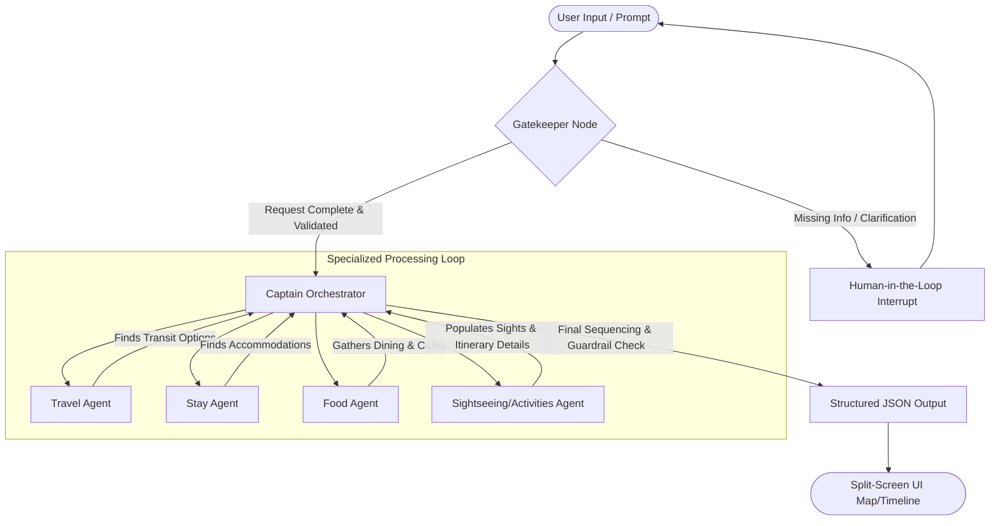

# Technical Design Document: Agentic Travel Planner

This document details the modular architecture, directory structure, data models, agent designs, and external tool integrations for the Prompt-to-Map Travel Planner.

---

## 1. System Architecture Overview

The system uses a stateful multi-agent workflow orchestrated as a directed graph. State is shared globally, allowing specialized agents to build upon the work of prior stages.

### Workflow Graph Diagram



### Agent Roles & Sequence

| Agent | Responsibility |
| :--- | :--- |
| **Gatekeeper** | Parses intent. Validates inputs (destination, duration, style, budget, group size). Interrupts for clarifying questions if critical info is missing. |
| **Captain** | The central orchestrator. Maintains state, routes to specialized agents, aggregates outputs, and runs final sequencing and guardrails (e.g. checking opening hours, travel distances). |
| **Travel** | Fetches and optimizes transit/transport options (flights, trains, local car hire). |
| **Stay** | Evaluates and selects accommodation options matching the user's travel style and budget. |
| **Food** | Sources dining options, prioritizing local culinary highlights, specialty cafes, and specific diet preferences. |
| **Sightseeing** | Gathers landmarks, activities, and museums; performs initial grouping. |

---

## 2. Directory Structure

```
travel-agents/
├── venv/                       # Python Virtual Environment
├── requirements.txt            # Project Dependencies
├── config.py                   # Configuration and Environment Variable Management
├── main.py                     # CLI Entry Point
├── server.py                   # FastAPI Application (web backend API)
├── src/
│   ├── __init__.py
│   ├── agents/                 # Agent Nodes (GenAI powered)
│   │   ├── __init__.py
│   │   ├── base.py             # Base Agent definition & GenAI configuration
│   │   ├── gatekeeper.py       # Gatekeeper logic and prompt engineering
│   │   ├── captain.py          # Orchestration, validation, and sequencing
│   │   ├── travel.py           # Transit selection agent
│   │   ├── stay.py             # Accommodation selection agent
│   │   ├── food.py             # Culinary/coffee selection agent
│   │   └── sightseeing.py      # Sightseeing & Activities agent
│   ├── tools/                  # External API Tool Wrappers
│   │   ├── __init__.py
│   │   ├── places.py           # POI Fetcher (Google Places API)
│   │   ├── routes.py           # Geocoding & Routing (Google Maps / Mapbox)
│   │   ├── flights.py          # Flight Search (SerpAPI / Amadeus)
│   │   └── hotels.py           # Hotel Search (SerpAPI / Amadeus)
│   ├── graph/                  # Workflow State & State Machine Configuration
│   │   ├── __init__.py
│   │   ├── state.py            # Pydantic schemas for the agentic State
│   │   └── workflow.py         # LangGraph (or State Machine) workflow construction
│   └── utils/                  # Helper utilities (clustering, mathematical sequencing)
│       ├── __init__.py
│       ├── clustering.py       # Location-based clustering algorithm (e.g. K-Means/DBSCAN)
│       └── time_helpers.py     # Transit and timezone validation helpers
└── tests/                      # Unit and integration tests
    ├── __init__.py
    ├── test_agents.py
    └── test_tools.py
```

---

## 3. Data Models & State Definition

We define the system state using Pydantic schemas. This ensures type safety and clean validations across all agent handoffs.

### 3.1. Itinerary Component Schemas

```python
from pydantic import BaseModel, Field
from typing import List, Optional

class Location(BaseModel):
    name: str = Field(..., description="Name of the place")
    address: str = Field(..., description="Physical street address")
    latitude: float = Field(..., description="Geographical latitude coordinate")
    longitude: float = Field(..., description="Geographical longitude coordinate")

class TimeWindow(BaseModel):
    open_time: str = Field(..., description="Opening time (HH:MM format)")
    close_time: str = Field(..., description="Closing time (HH:MM format)")

class POI(BaseModel):
    id: str = Field(..., description="Unique identifier for the point of interest")
    name: str = Field(..., description="Name of the location")
    category: str = Field(..., description="Category (e.g., Food, Stay, Sightseeing, Transit)")
    location: Location
    rating: Optional[float] = Field(None, description="Average review rating")
    hours: Optional[TimeWindow] = None
    time_spent_minutes: int = Field(120, description="Estimated stay/visit duration in minutes")
    cost_estimate: Optional[float] = Field(None, description="Average cost in local currency")
    description: str = Field(..., description="Short explanation of why it fits the traveler's style")

class TransitSegment(BaseModel):
    origin_poi_id: str
    destination_poi_id: str
    mode: str = Field(..., description="Transit mode (e.g., walking, driving, transit)")
    duration_minutes: int = Field(..., description="Estimated travel time in minutes")
    distance_meters: float = Field(..., description="Distance in meters")
    route_polyline: Optional[str] = Field(None, description="Encoded polyline representing the transit path")

class DayPlan(BaseModel):
    day_number: int
    date: str
    theme: str = Field(..., description="Theme/focus area of the day")
    schedule: List[POI] = Field(default_factory=list, description="Chronological timeline of activities")
    transit: List[TransitSegment] = Field(default_factory=list, description="Transit details between scheduled activities")

class FullItinerary(BaseModel):
    destination: str
    duration_days: int
    start_date: Optional[str] = None
    budget_level: str
    travel_style: List[str]
    accommodation: Optional[POI] = None
    days: List[DayPlan] = Field(default_factory=list)
```

### 3.2. Global Agent State

```python
from typing import List, Dict, Any
from pydantic import BaseModel

class AgentState(BaseModel):
    user_prompt: str
    parsed_parameters: Dict[str, Any] = {}
    clarification_questions: List[str] = []
    clarification_responses: Dict[str, str] = {}
    is_validated: bool = False
    
    # Candidate lists compiled by specialized agents
    candidate_transit: List[Any] = []
    candidate_accommodation: List[POI] = []
    candidate_food: List[POI] = []
    candidate_activities: List[POI] = []
    
    # Final consolidated output
    final_itinerary: Optional[FullItinerary] = None
    validation_warnings: List[str] = []
```

---

## 4. Agent Detailed Specifications

All agents are configured via a base model client (Gemini 2.5 Pro or Flash) leveraging structured JSON outputs or tool calling.

### 4.1. Gatekeeper Node
*   **Prompt Strategy:** Instruct the LLM to extract: `destination`, `duration_days`, `travel_style`, `budget_level`, `group_size`.
*   **Validation Rule:** If `destination` or `duration_days` is absent, set `is_validated = False` and populate `clarification_questions`.
*   **Human-in-the-Loop Interrupt:** If `is_validated` is false, the graph pauses, returns control to the user to capture inputs, and updates `clarification_responses` before resuming.

### 4.2. Captain Node (Orchestrator)
*   **Routing Logic:** Inspects the current state. Directs sequential flow through the active specialized agents (Travel -> Stay -> Food -> Sightseeing).
*   **Refinement & Sequencing:** Groups fetched activities geographically (using K-means or DBSCAN spatial grouping), schedules day-by-day itineraries, and runs transit checks.
*   **Guardrails Validation:** Checks that:
    1. Activities fall inside their respective opening hours.
    2. Transit segments do not exceed realistic budgets (e.g. walking time between cities is flagged).
    3. The budget constraints match selected spots.

### 4.3. Specialized Agents (Travel, Stay, Food, Sightseeing)
*   **General Behavior:** Given the current trip parameters, formulate search queries, invoke corresponding tools (APIs), evaluate top results, and populate candidate lists in the shared state.
*   **Stay Agent:** Focuses on hotel queries centered near the key transport links or local city hotspots.
*   **Food Agent:** Prioritizes localized cuisine matching the user's specific culinary preferences (e.g., "coffee enthusiast", "gluten-free options").
*   **Sightseeing Agent:** Focuses on popular landmarks and schedules activities.

---

## 5. External Tools & APIs

Below are the schemas and configurations for the external tools.

### 5.1. POI Fetcher (Google Places API)
Used by Food and Sightseeing agents to fetch locations.

```python
# src/tools/places.py
import requests
from typing import List, Dict, Any

class PlacesAPIWrapper:
    def __init__(self, api_key: str):
        self.api_key = api_key
        self.base_url = "https://places.googleapis.com/v1/places:searchText"

    def search_places(self, query: str, latitude: float, longitude: float, radius: int = 5000, category: str = None) -> List[Dict[str, Any]]:
        """
        Uses Google Places API (New) to search for locations within a radius.
        """
        headers = {
            "Content-Type": "application/json",
            "X-Goog-Api-Key": self.api_key,
            "X-Goog-FieldMask": "places.id,places.displayName,places.formattedAddress,places.location,places.rating,places.regularOpeningHours"
        }
        payload = {
            "textQuery": query,
            "locationBias": {
                "circle": {
                    "center": {"latitude": latitude, "longitude": longitude},
                    "radius": radius
                }
            }
        }
        response = requests.post(self.base_url, json=payload, headers=headers)
        response.raise_for_status()
        return response.json().get("places", [])
```

### 5.2. Geocoding & Routing (Google Maps Routes API)
Used by Captain and Specialized agents to calculate transit durations, distances, and paths.

```python
# src/tools/routes.py
import requests
from typing import Dict, Any

class RoutesAPIWrapper:
    def __init__(self, api_key: str):
        self.api_key = api_key
        self.base_url = "https://routes.googleapis.com/directions/v2:computeRoutes"

    def get_route(self, origin_lat: float, origin_lng: float, dest_lat: float, dest_lng: float, mode: str = "DRIVE") -> Dict[str, Any]:
        """
        Computes route segment, including distances, duration, and polylines.
        Modes: DRIVE, BICYCLE, WALK, TRANSIT.
        """
        headers = {
            "Content-Type": "application/json",
            "X-Goog-Api-Key": self.api_key,
            "X-Goog-FieldMask": "routes.duration,routes.distanceMeters,routes.polyline.encodedPolyline"
        }
        payload = {
            "origin": {"location": {"latLng": {"latitude": origin_lat, "longitude": origin_lng}}},
            "destination": {"location": {"latLng": {"latitude": dest_lat, "longitude": dest_lng}}},
            "travelMode": mode,
            "routingPreference": "TRAFFIC_AWARE" if mode == "DRIVE" else None
        }
        response = requests.post(self.base_url, json=payload, headers=headers)
        response.raise_for_status()
        routes = response.json().get("routes", [])
        return routes[0] if routes else {}
```

### 5.3. Flights & Hotels Search (SerpAPI / Amadeus API)
Used by Travel and Stay agents to fetch options.

```python
# src/tools/flights.py & src/tools/hotels.py
# Amadeus API endpoints used:
# - Flight Offers Search: GET /v2/shopping/flight-offers
# - Hotel Search: GET /v1/reference-data/locations/hotels/by-city & GET /v3/shopping/hotel-offers
```

---

## 6. Implementation Workflow & Validation Plan

### Phase 1: Engine Foundation
1. **State Machine Hookup:** Configure LangGraph or a simple functional routing wrapper handling execution state.
2. **Mocking Tools:** Implement mock versions of `PlacesAPIWrapper` and `RoutesAPIWrapper` (returning realistic static values) for local verification without consuming API credits.
3. **Structured Outputs:** Configure the Gemini LLM node prompts to guarantee output structures match the defined Pydantic classes exactly.

### Phase 2: Agent Refinement
1. Write specific unit tests for individual nodes (e.g. sending incomplete inputs to the Gatekeeper and testing if the interrupt state activates).
2. Wire real APIs into `src/tools/` using configuration keys loaded from environment files (`.env`).
3. Refine spatial clustering: Use a bounding box or hierarchical clustering algorithm (DBSCAN based on distance matrix) to ensure DayPlan activities are geographically clustered.

### Phase 3: Web Integration & Guardrails
1. Implement FastAPI routes for starting a planning task, responding to clarifying questions, and retrieving final itinerary JSON.
2. Validate final itineraries: Execute guardrails parsing opening hours and generating warnings if constraints are breached.
